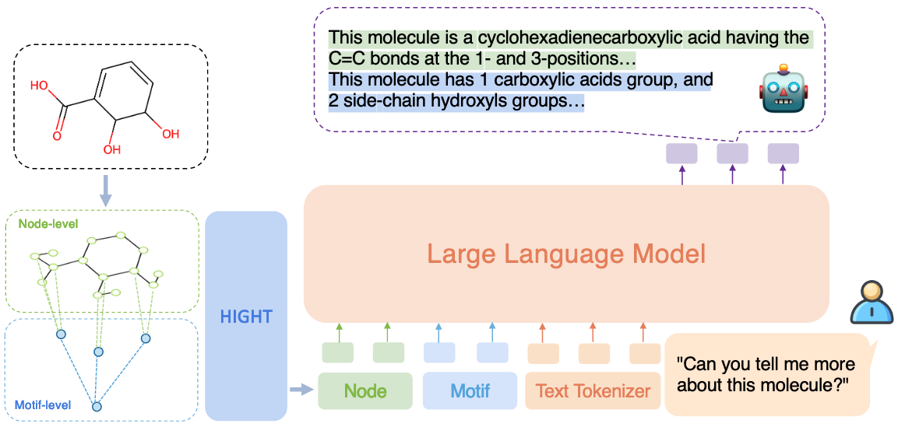

## HIGHT
  

* Chen et al.의 [HIGHT: Hierarchical Graph Tokenization for Graph-Language Alignment](https://higraphllm.github.io/) 논문을 reproducing하였습니다.  
* 코드 reproducing의 타당성을 설명하기 위해 논문의 식들을 본문 번호 그대로 인용하였습니다.

## 차용한 것들

### Motif
* 논문 4.1절의 첫 문단에서, motif로 분해하는 데에 BRICS를 사용했다고 밝혔다.
* 같은 절 두 번째 문단에서는 Zang et al., 2023, 즉 HiMol 방법을 따라서 motif-level을 추가했다고 밝혔다.
* 동시에, atom과 motif에 각각 VQVAE를 사용했다고 밝혔으며, 3.1절에서 Mole-BERT의 tokenizer를 고려했다고 밝히고 있다.
* 따라서,
  1. **[HiMol](https://www.nature.com/articles/s42004-023-00825-5)과 같은 방식으로 dataset**을 구축해 node와 motif 정보를 불러오고, 
  2. **[Mole-BERT](https://openreview.net/forum?id=jevY-DtiZTR)와 같은 방식**으로 이들 각각에 대한 **tokenizer를 학습**하도록 했다
* 이때 HiMol과 Mole-BERT의 feature 정의 방식이 다르다.
  1. node feature:  
      * HiMol은 `[atom_idx, degree]`를 이용하는데, Mole-BERT는 `[atom_idx, chirality]`를 이용한다.
      * 일반적으로 후자를 보통 사용하므로, 우리도 후자를 이용해서 정의했다.
      * 또한 HiMol은 실제 원자번호와 일치 (H = 1)시키지만 Mole-BERT는 아니다 (H = 0). 이에 있어서는 HiMol과 동일하게 일치시켜 사용한다.
  2. motif / graph feature:  
      * HiMol은 motif는 `[120, 0]`으로, graph는 `[119, 0]`으로 통일해서 사용한다.
      * 우리는 `0` 대신 `3`을 이용한다. RDKit에서 38 가지 기본 fragment 패턴을 제공하긴 하지만, 말그대로 패턴이기에 동일한 것을 지칭할 수 없다.
      * 이때 chirality = 3은, `OTHER`를 의미한다. 기존 0에 해당하는 `UNSPECIFIED`는 atom에서도 많이 나오며, motif나 graph의 chirality는 atom과는 *다른 무언가*이기 때문에 `OTHER`를 사용하였다.
* 이렇게 int로 정의된 feature는 GNN에 들어가기 전에 `nn.Embedding`으로 임베딩되어 들어간다. dimension은 Mole-BERT와 동일하게 설정하였다.
* atom과 motif에 각각 VQVAE를 사용했다곤 하지만, Mole-BERT에서 이미 C, N, O, 그리고 기타 원소들로 codebook을 분리해서 사용하고 있기 때문에 우리는 이를 확장해서 **codebook을 C, N, O, 기타원소, motif, 그리고 그래프 전체로 분리해서 사용**한다.
* 논문의 3.1절에서 $u$번째 임베딩 $\boldsymbol{h}\_u$을 코드북 $\boldsymbol{e}$에 대응시켜 $z\_u$로 만드는 것은 Eq. 5, 코드북과 GNN을 학습시키기 위한 로스$\mathcal{L}\_r$는 Eq. 6과 같이 설명하고 있다.  
  $$z\_u=\underset{i}{\arg \min} \lVert \boldsymbol{h}\_u - \boldsymbol{e}\_i \rVert\_2 \ldots \left( \text{Eq. 5} \right)$$  
  $$\mathcal{L}\_r = \frac{1}{n}\sum\_{i=1}^n\left( 1 - \frac{\boldsymbol{v}\_i^T \hat{\boldsymbol{v}}\_i} {\lVert \boldsymbol{v}\_i \rVert \cdot \lVert \hat{\boldsymbol{v}}\_i \rVert} \right)^{\gamma} + \frac{1}{n}\sum\_{i=1}^n \lVert \mathbf{sg}\left[ \boldsymbol{h}\_i \right] - \boldsymbol{e}\_{z_i} \rVert_2^2 + \frac{\beta}{n} \sum\_{i=1}^n \lVert \mathbf{sg}\left[ \boldsymbol{e}\_{z\_i}\right]-\boldsymbol{h}\_i \rVert\_2^2\ldots\left(\text{Eq. 6}\right)$$
  * 여기서 $\beta$는 하이퍼파라미터로, HIGHT에서는 밝히지 않고 있지만 Mole-BERT에서는 `0.25`를 기본값으로 사용하고 있다.
  * 또한 첫 번째 term의 $\boldsymbol{v}_i$는 input feature이고, $\hat{\boldsymbol{v}}_i$는 reconstruct된 feature이다.
    * 하지만 Eq.6을 인용해온 Mole-BERT의 4.1절에 나오는 Eq. 4에서 해당 term을 `"reconstruction loss with the scaled cosine error"`라 설명하고 있지만, Mole-BERT의 코드에서는 VQVAE 원 논문과 동일하게 단순한 CrossEntropy를 사용하고 있다.
    * 또한 Mole-BERT에서 아이디어를 차용했다는 DALL-E에서도 `"scaled cosine error"`에 대한 설명은 나와 있지 않다.
    * 따라서 우리 역시 단순한 CE loss를 그대로 사용하지만, 함수화 해두었기에 추후에 변경은 가능하다.
* `bash `[`./scripts/step01_train_vqvae.sh`](https://github.com/Syzseisus/HIGHT/blob/main/scripts/step01_train_vqvae.sh)과 `bash `[`./scripts/step02_train_tmcl.sh`](https://github.com/Syzseisus/HIGHT/blob/main/scripts/step02_train_tmcl.sh)를 통해 토크나이저를 학습시켜둔다.
* `bash `[`./scripts/stepXX_molebert_ft_classfication.sh](https://github.com/Syzseisus/HIGHT/blob/main/scripts/stepXX_molebert_ft_classfication.sh)을 이용해 classification dataset에 대해 finetuning 및 테스트가 가능하다.
  ```
  # 실행 script
  bash ./scripts/stepXX_molebert_ft_classfication.sh \
      --per_device_train_batch_size 4096 \
      --per_device_valid_batch_size 4096 \
      --per_device_test_batch_size 4096 \
      --tmcl_ckpt_path ./save/tmcl/ckpt/run-20241120_094738-atom_128_each__motif_graph_64_9zd51xls/last.ckpt
  ```
  Table: Comparison between original paper results and our reproduced results (AUC-ROC scores).  
  Reproduced results are evaluated using three different checkpoints: the last epoch, the best training loss, and the best validation AUC.
  | Dataset | Paper | Last Epoch | Best Train Loss | Best Val AUC |
  |---------|-------|------------|-----------------|--------------|
  | Tox21   | 76.8  | 71.90      | 71.75           | 71.90        |
  | ToxCast | 64.3  | 60.10      | 57.53           | 60.10        |
  | Sider   | 62.8  | 59.04      | 60.27           | 58.47        |
  | ClinTox | 78.9  | 83.52      | 83.19           | 83.47        |
  | MUV     | 78.6  | 72.38      | 51.84           | 73.52        |
  | HIV     | 78.2  | 71.71      | 72.93           | 73.33        |
  | BBBP    | 71.9  | 70.59      | 58.55           | 63.69        |
  | BACE    | 80.8  | 75.43      | 76.26           | 77.37        |


### LGLM 구조
* 논문 2장: Tang et al., 2023, Chen et al., 2024, Liu et al., 2023d, Zhao et al., 2023, Cao et al., 2023, Li et al., 2024 등에서는 Eq. 3과 같이 LLM $p_\theta$에 task 질문 $\boldsymbol{q}$와 projection layer $f_n\left(\cdot\right)$을 거친 그래프 임베딩 $\boldsymbol{h}$만을 입력하여 autogressive하게 정답 $\boldsymbol{a}$를 생성하는 LGLM이다.  
  $$p_\theta\left(\boldsymbol{a}|\boldsymbol{q},\boldsymbol{h}\right) = \prod_{i=1}^{l_a} p_\theta\left(\boldsymbol{a}\_i | \boldsymbol{q}, f_n\left(\boldsymbol{h}\right), \boldsymbol{a}_{\lt i} \right)\ldots\left(\text{Eq. 3}\right)$$
  
* 논문 3.1절: 이를 InstructMol에서는 Eq. 4와 같이 하나의 그래프 임베딩을 받는 것에서 n개의 노드 임베딩 $\boldsymbol{h}\_i$을 받는 것으로 확장하였다.
  $$p_\theta\left(\boldsymbol{a}|\boldsymbol{q},\boldsymbol{h}\right)=\prod\_{i=1}^{l_a}p_\theta\left(\boldsymbol{a}_i|\boldsymbol{q},f_n\left(\boldsymbol{h}_1\right),\ldots,f_n\left(\boldsymbol{h}_n\right),\boldsymbol{a}\_{\lt i}\right)\ldots\left(\text{Eq. 4}\right)$$
* 논문 4.1절: 이를 HIGHT에서는 ZHANG et al., 2021과 Zang et al., 2023 등에서 계층적 GNN의 자기지도 학습이 잘 된 것에서 착안해, Eq. 8과 같이 motif $\mathcal{M}^{\left(i\right)}$까지 입력하는 것으로 확장했다. 주어진 분자가 $k$ 개의 motif를 가지고 있을 때, $k+1$번째 motif로써 전체 그래프를 사용한다. $f_n, f_m, f_g$는 각각 node, motif, graph 임베딩에 대한 projection layer이다.
  $$p_\theta \left( \boldsymbol{a}|\boldsymbol{q},\boldsymbol{h} \right)=\prod_{i=1}^{l_a} p_\theta \left( \boldsymbol{a}_i|\boldsymbol{q},f_n\left( \boldsymbol{h}_1 \right), \ldots, f_n \left( \boldsymbol{h}\_n \right ) ,f\_m \left( \boldsymbol{h}\_m^{\left( 1\right )}\right ),\ldots,f\_m\left(\boldsymbol{h}\_m^{\left(k\right)}\right),f\_g\left(\boldsymbol{h}\_m^{\left(k+1 \right)} \right),\boldsymbol{a}\_{\lt i}\right)\ldots\left(\text{Eq. 8}\right)$$
* InstructMol이 코드를 제공하긴 하지만, 데이터셋을 제공하지 않아 디테일 정보를 알기 힘들다. 따라서 **[GraphGPT](https://github.com/HKUDS/GraphGPT)의 코드를 기반**으로 사용한다.
* positional encoding으로 Dwivedi et al., 2020의 `Laplacian positional embeddings`를 사용한다.
  * 이는 `from torch_geometric.transforms import AddLaplacianEigenvectorPE`를 통해 구현할 수 있다.
  * The number of non-trivial eigenvectors to consider.를 의미하는 `k`를 정해야 하는데, 이 `k`는 결국 positional embedding의 차원과도 같다.
  * 따라서 모든 그래프에 동일한 값을 사용해야 하고, [CProMG](https://academic.oup.com/bioinformatics/article/39/Supplement_1/i326/7210458) 논문에 따라 기본값을 `8`로 정하고, hyperparameter로 남겨, 추후에 `k`값에 따른 ablation을 진행할 수 있도록 하였다.
  * 해당 논문과 같이 `nn.Linear`를 통해 atom feature의 `nn.Embedding` output dim과 동일하게 projection하고 둘을 더하는 방식으로 positional embedding을 적용하였다.
    * 이 방법은 일반적인 Transformer에서 input feature에 positional embedding을 더하는 것과 동일하다.
* TODO: align 하고 나서 finetuning


### Dataset

#### Hierarchical Graph Instruction Tuning Dataset
* 논문 4.2절에서 tokenizer를 통해 임베딩이 잘 되더라도 LLM이 이해하는 것과는 별개이기에, `HiPubChem`을 구축했다고 한다.
* **PubChem** 데이터셋에서 제공되는 text를 다음과 같이 변경하였다.
  * positive pair: `"This molecule has <#> of <functional group name> groups."`
  * negative pair: `"This molecule has no <functional group name> groups."`
  * positive pair는 갖고 있는 모든 functional group을 사용하고, negative로는 랜덤한 $k_\text{neg}$개의 functional group을 사용하였다.
  * $k_\text{neg}$는 논문에서 ablation을 진행하기에 hyperparmeter로 조정할 수 있도록 하였다.
* TODO: [`dataset 구축`]()을 통해 생성하며, `/path/to/data_root/HiPubChem` 경로에 `pretrain.txt` 파일을 위치시켜야한다.

#### Downstream Dataset
* 논문 4.3절의 Stage 2 섹션에서 밝힌 것처럼, 아래의 세 개 데이터셋을 사용한다.
1. **MoleculeNet**과 Chemical Reaction Prediction: 논문 5.3절과 5.5절에서 Fang et al., 2024, 즉 Mol-Instruction 논문의 방법을 따랐다고 하기 때문에, 해당 논문에서 제공하는 [데이터셋](https://huggingface.co/datasets/zjunlp/Mol-Instructions)을 사용한다.
  * `./data_preprocess/MolInstructions/split_data.py` 파일을 통해 split 데이터셋을 `data_root`에 저장할 수 있다.
2. **ChEBI-20**: 해당 데이터셋은 Text2Mol의 공식 repository에 데이터를 구축하는 방법이 제공되어 있으며, 파일까지 제공되어 있다. [여기](https://github.com/cnedwards/text2mol/tree/master/data)에서 받을 수 있다.
  * 해당 파일을 `./data/ChEBI-20` 폴더 아래에 위치 시켜야한다.
3. for :  논문 5.5절에서 세 가지 데이터셋 모두 Mol-Instruction에서 가져왔다고 하기 때문에, 해당 논문에서 제공하는 데이터셋을 사용한다. [여기](https://huggingface.co/datasets/zjunlp/Mol-Instructions/blob/main/data/Molecule-oriented_Instructions.zip)에서 받을 수 있다.

#### Motif Hallucination
* 논문 3.2절에서 pretrain을 위해 `MotifHallu`라는 데이터셋을 구축했다고 한다.
* RDKit에서 사용하는 [38개의 기본 functional group](https://github.com/rdkit/rdkit/blob/master/Data/FunctionalGroups.txt)에 대해서 Li et al., 2023c와 같은 방식으로 `"Is there a <functional group name> in the molecule?"` 이라는 질문에 대해 `"Yes"`, `"No"`로 답할 수 있는지를 확인하는 하나의 평가를 위한 데이터셋이다.
* 사용한 데이터셋은 **ChEBI-20** dataset의 test split에 해당하는 3300개의 분자이며, positive pair로는 분자가 갖고 있는 모든 functional group을 사용하고, negative pair로는 갖고 있지 않은 functional group 중에 랜덤하게 6개를 선택해서 구축해서, 총 23,924개의 쌍을 만들었다.
* TODO: [`dataset 구축`]()을 통해 생성하며, `/path/to/data_root/MotifHallu` 경로에 `test.txt` 파일을 위치시켜야한다.
